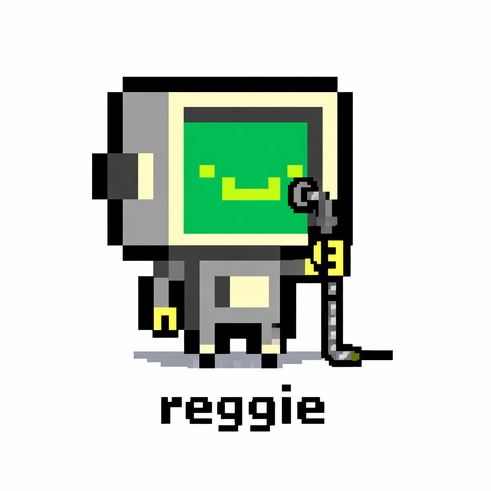

# Reggie

<p align="center">
  
</p>

**Brain-dump to merged PR. Reggie is a desktop app and agent system for Claude Code that turns messy notes into shipped code.**

Dump features, bugs, and half-formed ideas into `TASKS.md`. Run `/reggie-init-tasks` to groom them into implementation-ready plans. Run `/reggie-code-workflow` in as many terminals as you want — each session picks a different task and ships it through a pipeline with quality gates. Reggie is a Tauri v2 desktop app backed by a bundled 36-agent pipeline system with memory. Everything runs locally — no external APIs, no cloud dependencies.

See [resources/docs/REGGIE.md](resources/docs/REGGIE.md) for the agent-system philosophy and principles.

---

## Daily Driver Loop

```text
Brain dump -> /reggie-init-tasks -> /reggie-code-workflow (xN in parallel)
```

1. Brain dump features/bugs/ideas into `TASKS.md`.
2. Run `/reggie-init-tasks` to turn rough notes into implementation-ready plans.
3. Run `/reggie-code-workflow` in one or many terminals; each session auto-picks a different eligible task and runs it in its own worktree.

For a new project, run `/reggie-new-repo` first. For an existing project, run `/reggie-onboard` first. Both paths feed the same loop above.

---

## Features

- **Workspace management** — group projects into workspaces and switch between them
- **Terminal multiplexer** — run multiple Claude Code sessions and shell terminals side by side with split view
- **Session history** — browse past Claude Code sessions per project
- **Skills manager** — install, uninstall, and browse Claude Code slash-command skills
- **Daily planner** — built-in task management
- **GitHub dashboard** — view issues and PRs via the GitHub CLI
- **Light & dark themes**
- **Bundled 36-agent pipeline system** — installed to `~/.claude/` on first launch, with quality gates and memory

---

## Installation

### Pre-built releases

Download from [Releases](https://github.com/The-Banana-Standard/reggie/releases).

| Platform | File |
|----------|------|
| macOS (Apple Silicon) | `Reggie_x.x.x_aarch64.dmg` |
| macOS (Intel)         | `Reggie_x.x.x_x64.dmg`     |
| Windows               | `Reggie_x.x.x_x64-setup.exe` |
| Linux (Debian/Ubuntu) | `Reggie_x.x.x_amd64.deb`   |
| Linux (other)         | `Reggie_x.x.x_amd64.AppImage` |

> **macOS users**: If macOS shows "Reggie is damaged and can't be opened", run:
> ```bash
> xattr -cr /Applications/Reggie.app
> ```

### Build from source

**Prerequisites:**
- [Rust](https://rustup.rs/) (stable toolchain)
- [Node.js](https://nodejs.org/) v18+
- [Tauri v2 prerequisites](https://v2.tauri.app/start/prerequisites/)

```bash
git clone https://github.com/The-Banana-Standard/reggie.git
cd reggie
npm install
npm run tauri build
```

---

## Development

```bash
# Run in development mode (hot reload)
npm run tauri dev

# Run frontend tests
npm test

# Run Rust tests
cargo test --manifest-path src-tauri/Cargo.toml

# Frontend-only dev server (no Tauri shell, limited use)
npm run dev
```

The Vite dev server runs on port 1420 with HMR enabled.

---

## What's bundled: the agent system

Reggie ships with a 36-agent pipeline system that installs to `~/.claude/` on first launch:

```
resources/
  agents/      36 agent definitions
  commands/    35 slash commands
  hooks/       stats tracking hook
  docs/        system documentation
  registries/  MCP and skills registries
```

On each launch, Reggie compares its bundled version against `~/.claude/.reggie-version`. If the bundled version is newer, all resources are re-installed automatically. In dev mode (`npm run tauri dev`), symlinks are used instead of copies for live editing.

**What happens on first launch:**
- Creates `~/.claude/{agents,commands,hooks,docs}` if missing
- Copies `reggie-*` prefixed files (your custom agents/commands are never touched)
- Merges PostToolUse stats hook into `settings.json` (preserves existing config)
- Creates local overlay files (`mcp-registry.local.yaml`, `skills-registry.local.yaml`) if missing
- Offers to configure `ENABLE_TOOL_SEARCH=auto:5` in your shell profile

See [resources/docs/REGGIE.md](resources/docs/REGGIE.md) for agent-system philosophy.

---

## Key Commands

| Command | What it does |
|---------|-------------|
| `/reggie-guide` | Help and command map |
| `/reggie-init-tasks` | Turn raw backlog notes into implementation-ready tasks |
| `/reggie-code-workflow` | Run full implementation pipeline with quality gates (`[code]`, `[design]` tasks) |
| `/reggie-debug-workflow` | Diagnose before fixing — Socratic debug dialogue (`[debug]` tasks) |
| `/reggie-system-change` | Formalize changes to agent system components (`[reggie-system]` tasks) |
| `/reggie-manual-task` | Walk through a manual task step-by-step (`[manual]` tasks) |
| `/reggie-find-tools` | Scan project and optionally configure MCP servers |
| `/reggie-status` | Show current task and pipeline stage |

---

## Architecture

- **Backend:** Rust (Tauri v2, portable-pty, tokio)
- **Frontend:** React 19 + TypeScript (strict), xterm.js v6
- **Storage:** JSON file (`app_data_dir/bookmarks.json`) via Tauri `read_bookmarks` / `write_bookmarks` commands
- **Build:** Vite 7, Cargo

---

## Capabilities Model

Versioned in git:
- `resources/registries/mcp-registry.yaml` (curated MCP registry)
- `resources/registries/skills-registry.yaml` (curated community skills registry)

Local/generated in `~/.claude/`:
- `capability-manifest.yaml` (generated by `/reggie-refresh-capabilities`)
- `mcp-registry.local.yaml` (optional local MCP overlay)
- `skills-registry.local.yaml` (optional local skills overlay)

`/reggie-find-tools` remains explicit and interactive. `/reggie-refresh-capabilities` is optional and refreshes local generated state.

---

## Documentation

- [resources/docs/REGGIE.md](resources/docs/REGGIE.md) — Philosophy and principles
- [resources/docs/PORTABLE-PACKAGE.md](resources/docs/PORTABLE-PACKAGE.md) — Full system reference
- [resources/docs/reggie-quickstart.md](resources/docs/reggie-quickstart.md) — Quickstart and install/update paths
- [resources/docs/agents-is-all-you-need.md](resources/docs/agents-is-all-you-need.md) — Why agents over tools
- [docs/open-source-release-checklist.md](docs/open-source-release-checklist.md) — Release operations

## Contributing

See [CONTRIBUTING.md](CONTRIBUTING.md).

## Security

See [SECURITY.md](SECURITY.md) to report vulnerabilities.

## License

MIT — see [LICENSE](LICENSE).
